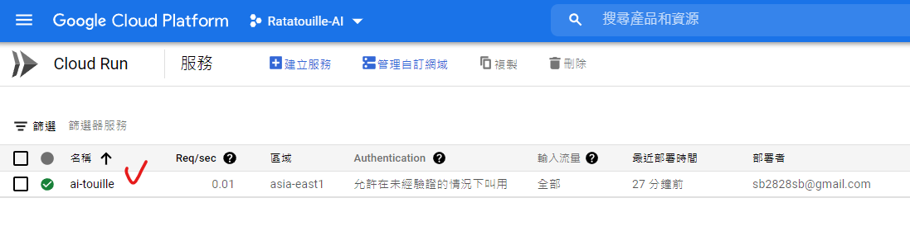
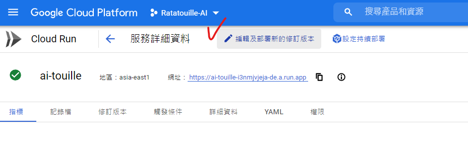
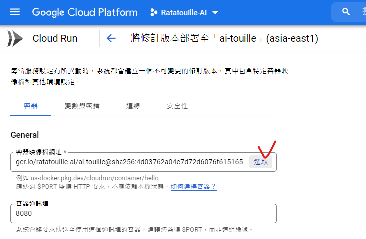
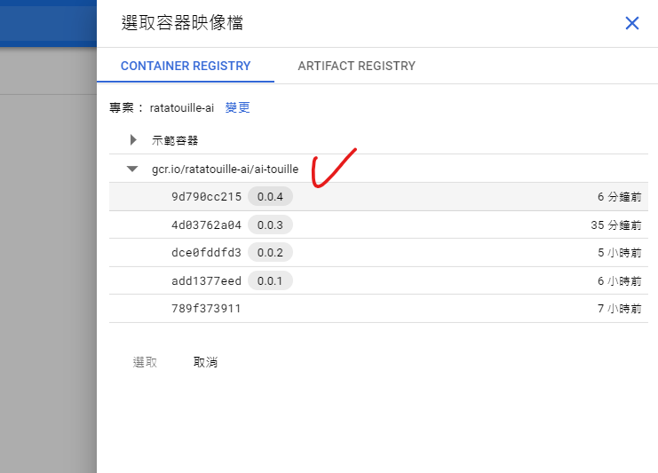

# 環境設定說明

### 環境變數(Environment Variables)設定

```
LINE_CHANNEL_ACCESS_TOKEN

LINE_CHANNEL_SECRET

USER_INFO_TEMP_BUCKET_NAME：存到 temp_food_image_mvp 這個 bucket

FOOD_IMAGE_BUCKET_NAME：存到 food-image-mvp 這個 bucket
```


### 建立映像檔，設定image路徑與版本號

先確認自己是否再對的資料夾(藍字)及GCP專案(黃字Ratatouille-AI)，如果沒有，請用以下指令設定指向GCP專案
```
gcloud config set project [project-id]
```

用docker打包成映像檔，其中 ```--tag``` 後面要接映像檔的名字，更新版本前可以先到GCP cloud run中查看之前更新到哪一版，將版本號往上加。
```
gcloud builds submit --tag gcr.io/$GOOGLE_CLOUD_PROJECT/ai-touille:0.0.1
```

查看映像檔及版本號路徑如以下截圖所示：










### 參考資料

